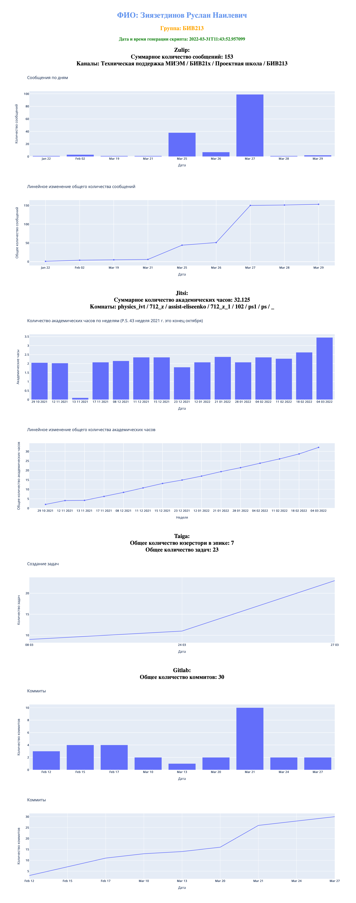

# Мини проект

Мини проект по дисциплине "Проектный семинар" за 1 курс ОП ИВТ МИЭМ, ВШЭ. Генерируется HTML страница с данными о цифровом следе студента в сервисах МИЭМа (Zulip, Jitsi, Taiga, Gitlab). Под цифровым следом на этих платформах подразумевается: 
* количество сообщений по дням (Zulip);
* количество академических часов за учебный год (Jitsi);
*  количество задач и юзерстори (Taiga); 
*  количество коммитов по дням (GitLab). 

По этим данным отрисовываются интерактивные графики и гистограммы. 
## Принцип работы
В `program.py` создаются post и get запросы к API цифровых сервисов МИЭМа. Принимаются JSON файлы, парсятся. И затем берётся вся нужная для графиков информация. Графики отрисовывются с помощью библиотеки plotly и вставляются в шаблон нашей страницы `template.html`.
* **edu_email** - первая корпоративная почта студента
* **miem_email** - вторая корпоративная почта студента
* **token** - API токен

